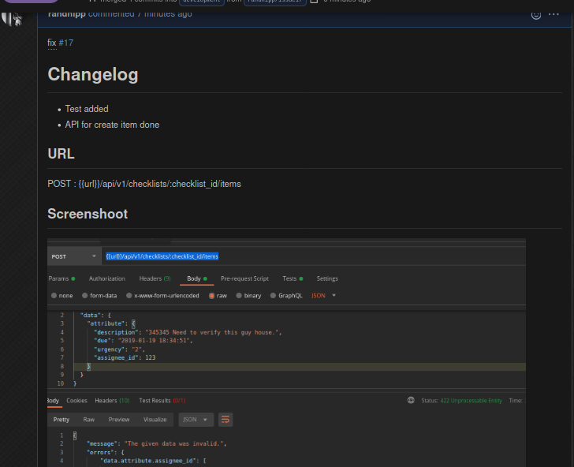

# CHECKLIST - BE Test

Laravel 8 with Sanctum
## How To Run - Local Development

1. Clone this repository 
   `git clone https://github.com/randhipp/checklist-laravel.git`


2. Copy `.env.example` to `.env` - setup your database and other settings.


3. Install dependency, run `composer install`.


4. Run `php artisan optimize`


5. Run `php artisan key:generate`


6. Migrate Database and create dummy data run `php artisan migrate --seed`

7. Start Development Server `php artisan serve`

8. Your API now live at http://localhost:8000/ 

## Live Development - CI/CD using deployer

API Endpoint : 
http://checklists.wafvel.com/api/v1

This endpoint always updated after push on development branch.
## Documentation 
docs : 
https://documenter.getpostman.com/view/6587471/TVev44px

export : 
[postman_export](./storage/checklist.postman_collection.json) 

Your auth token is written in the stderr. You can also generate new token at create token endpoint to test the API using this email and password :

email : admin@admin.com
password : password

## Testing

#### Postman Test

Download the file and import to postman to run test to this API.


#### PHPUnit

This microservice is tested with provided schema.

```bash
# You are free to define other testing environment configuration values as necessary. 
# The testing environment variables may be configured in the phpunit.xml file, 
# but make sure to clear your configuration cache 
# using the config:clear Artisan command before running your tests!

# to make sure use the .env.testing
php artisan config:clear

# use phpunit
vendor/bin/phpunit 

# or use php artisan test
php artisan test 
```


# Changelog

Changelog written on pull request

eg changelog on :     
https://github.com/randhipp/checklist-laravel/pull/18    
https://github.com/randhipp/checklist-laravel/pull/20    


